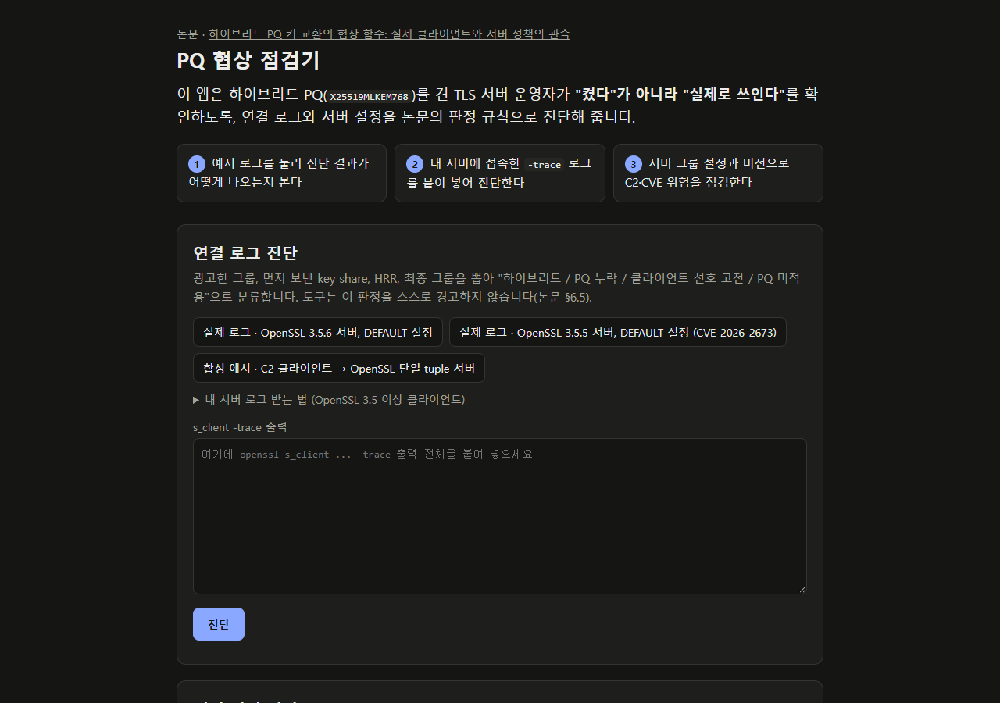
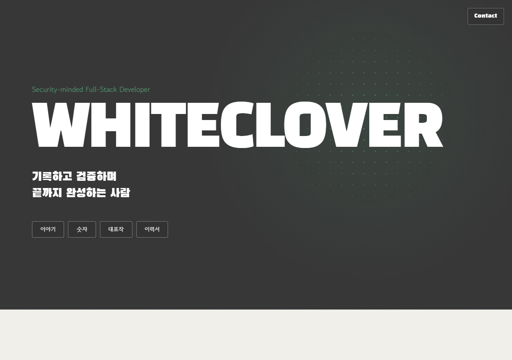
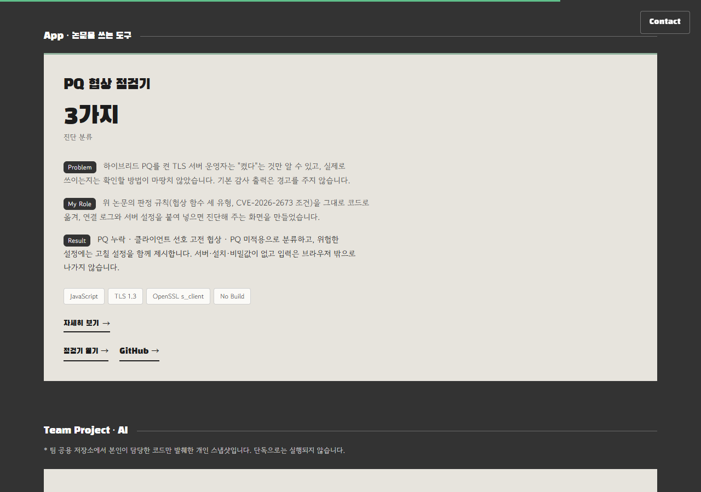
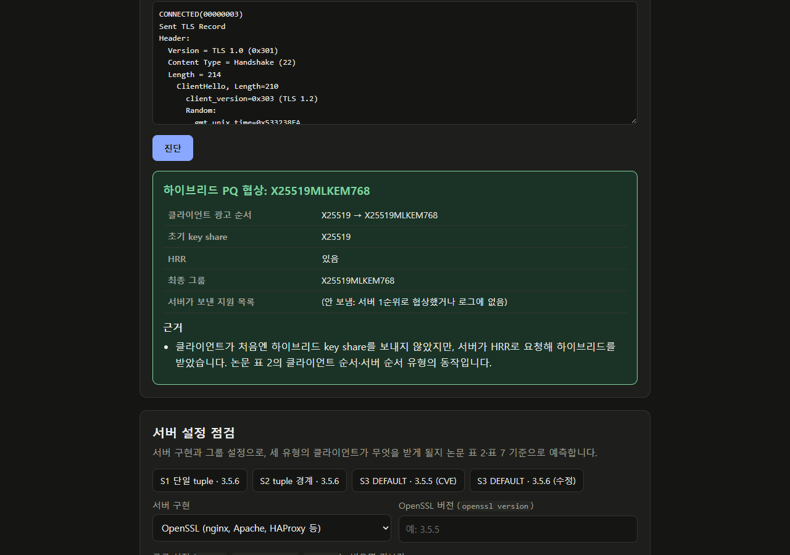
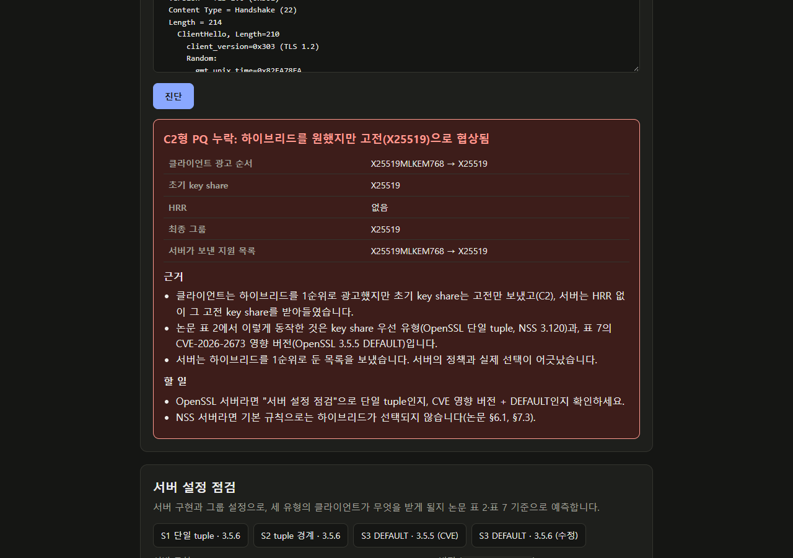
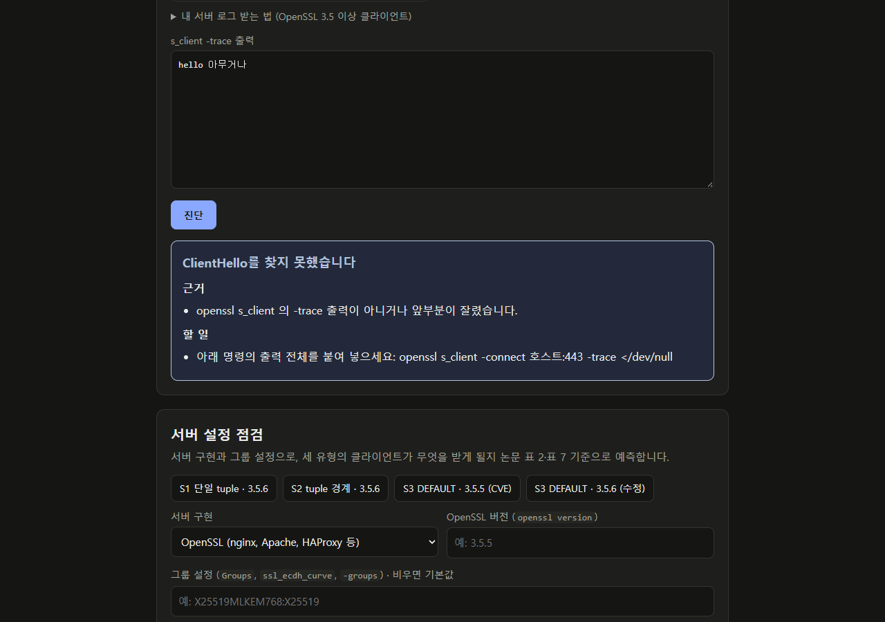
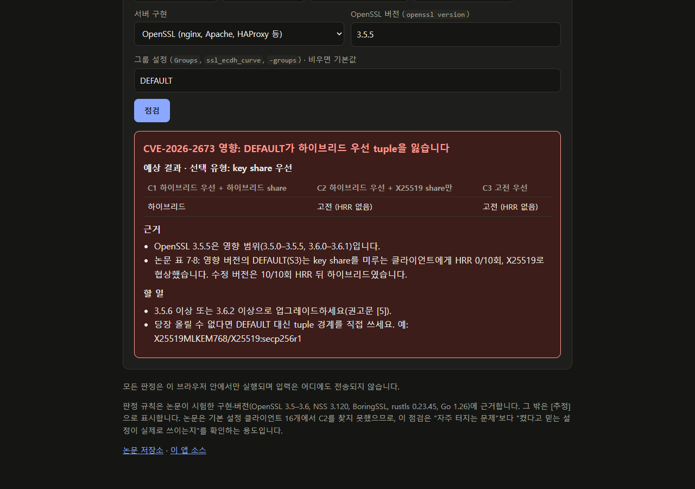
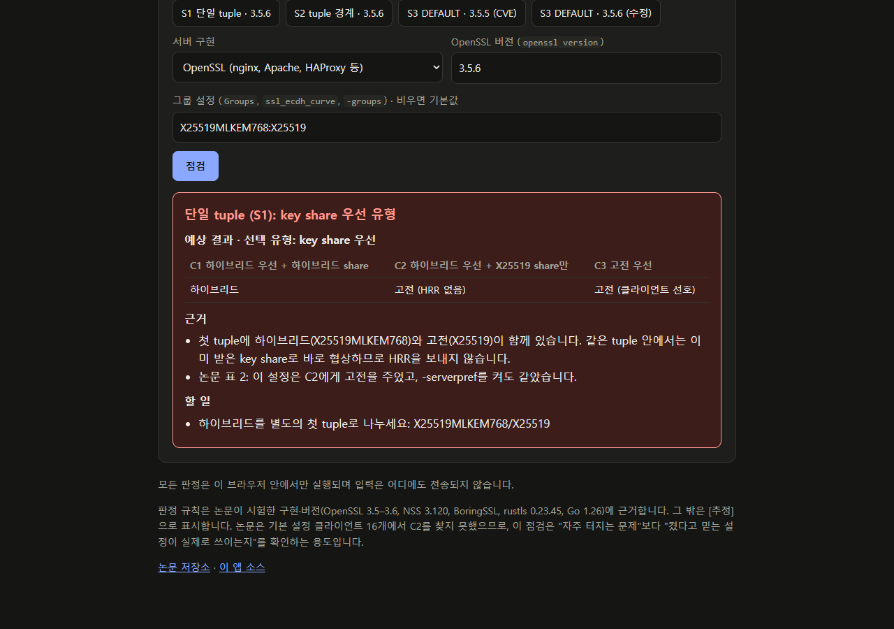

# 마지막 B 제출문 — PQ 협상 점검기

## 제출물

| 무엇 | 주소 |
|---|---|
| 결과물 URL (앱) | https://whiteclover0542.github.io/pq-tls-negotiation-checker/ |
| 12번 사이트 (포트폴리오) | https://whiteclover-portfolio.vercel.app/ → "대표작" → "App · 논문을 쓰는 도구"의 "PQ 협상 점검기" 카드 |
| 앱 소스 | https://github.com/whiteclover0542/pq-tls-negotiation-checker |
| 참고 논문 | https://github.com/whiteclover0542/pq-hybrid-downgrade (본문 `docs/PAPER.md`, 영문 `docs/PAPER.en.md`) |

모든 링크는 로그인, 계정, 인증 없이 열립니다. 앱은 서버, 설치, 비밀값이 없는 정적 페이지입니다.

## 참고 논문 — 무엇을 밝혔나

**제목**: 하이브리드 PQ 키 교환의 협상 함수: 실제 클라이언트와 서버 정책의 관측

양자 내성 하이브리드 키 교환(`X25519MLKEM768`)을 서버에 켜도 실제 연결에서 하이브리드가 협상되는지를 측정한 논문입니다. 다운그레이드 저항성 증명은 공격자의 메시지 조작은 막아 주지만, 정상 연결에서 서버가 어떤 그룹을 고르는지(협상 함수)는 보장하지 않습니다. 논문은 이 간극을 관측했습니다.

- **협상 함수 세 유형 (표 2)**: 똑같이 하이브리드를 1순위로 설정한 TLS 서버 다섯 종이 세 가지로 갈렸습니다. key share 우선(OpenSSL 단일 tuple, NSS), 클라이언트 순서(BoringSSL, rustls), 서버 순서(Go, OpenSSL tuple 경계)입니다.
- **C2형 PQ 누락**: 하이브리드를 선호하지만 처음에 `X25519` key share만 보내는 클라이언트(C2)는 key share 우선 서버에서 HRR 없이 고전 그룹으로 연결됩니다.
- **CVE-2026-2673**: OpenSSL의 `DEFAULT` 그룹 설정이 하이브리드 우선 순서를 잃는 결함입니다. 영향 버전은 3.5.0–3.5.5, 3.6.0–3.6.1이며, 수정 코드만 넣고 빼는 실험으로 원인을 분리해 재현했습니다 (표 7·8).
- **경로상 조작 60회**는 모두 연결 실패로 끝났습니다. 증명이 보장하는 영역은 실제로도 막혀 있습니다.
- **감사 가시성**: 측정한 기본·상세 도구 출력 어디에도 이 상황을 알리는 자동 경고가 없었습니다.
- **결론**: "하이브리드를 켰다"와 "하이브리드가 쓰이고 있다"는 따로 확인해야 합니다.

## 앱 — 논문 결과를 어떻게 쓰나

**한 문장**: 하이브리드 PQ를 켠 TLS 서버 운영자가 "켰다"가 아니라 "실제로 쓰인다"를 확인하도록, 연결 로그와 서버 설정을 논문의 판정 규칙(협상 함수 세 유형, CVE-2026-2673 조건)으로 진단합니다.

논문이 "도구가 경고하지 않는다"고 밝힌 부분을 앱이 대신 경고합니다.

- **연결 로그 진단**: `openssl s_client -trace` 출력에서 광고 그룹, 초기 key share, HRR, 최종 그룹을 뽑아 "하이브리드 / PQ 누락 / 클라이언트 선호 고전 / PQ 미적용"으로 분류합니다. 예시 로그 두 개는 논문 저장소의 실제 측정 기록입니다.
- **서버 설정 점검**: 서버 구현, OpenSSL 버전, 그룹 설정을 넣으면 C1·C2·C3 클라이언트가 각각 무엇을 받게 될지 표 2·7 기준으로 예측합니다. 위험한 설정에는 고칠 설정을 함께 제시합니다.

*첫 화면: 논문 제목, 앱 한 문장, 할 일 세 가지*

## 12번 사이트 — 어디에 연결했나

12번 사이트는 함께 일할 팀원에게 "내가 누구인지" 보여 주려고 만든 개인 포트폴리오입니다. "이야기 / 숫자 / 대표작 / 이력서"로 구성되어 있습니다. 대표작 섹션에는 논문 두 편(PQ Hybrid Downgrade, Security Telemetry Loss)이 있고, 그 아래 "App · 논문을 쓰는 도구" 자리에 이 앱을 연결했습니다.

카드는 Problem / My Role / Result 순서로 누구를 어떻게 돕는지를 설명합니다. "점검기 열기 →"를 누르면 앱이, "GitHub →"를 누르면 소스가 열립니다.

*포트폴리오 첫 화면: "대표작" 버튼으로 이동*

*대표작의 "App · 논문을 쓰는 도구" 자리에 연결한 PQ 협상 점검기 카드*

## 확인 방법

**어디에 무엇이 있나**: 앱 URL 한 페이지에 위에서부터 논문 제목, 앱 한 문장, 할 일 세 가지, "연결 로그 진단", "서버 설정 점검"이 있습니다.

| 할 일 | 해 보는 법 | 이렇게 나오면 통과 |
|---|---|---|
| 1. 예시 로그 진단 | "연결 로그 진단"의 예시 버튼 세 개를 차례로 누른다 | 3.5.6 → "하이브리드 PQ 협상", 3.5.5 → "클라이언트 선호 고전 협상 (C3)", 합성 C2 → "C2형 PQ 누락" |
| 2. 내 로그 진단 | 입력칸에 `openssl s_client -trace` 출력을 붙여 넣고 "진단"을 누른다. 아무 글자나 넣어도 된다 | 로그면 판정이 나오고, 엉뚱한 입력이면 "ClientHello를 찾지 못했습니다"가 나오며 앱이 멈추지 않는다 |
| 3. 설정 점검 | 버전 `3.5.5`, 그룹 `DEFAULT`로 "점검"을 누른다. 이어서 `3.5.6`, `X25519MLKEM768:X25519`로 다시 누른다 | "CVE-2026-2673 영향"이 나오고, 다음에는 "단일 tuple (S1)"과 고친 설정 `X25519MLKEM768/X25519` 제안이 나온다 |

| 할 일 1 — 실제 로그 (3.5.6) | 할 일 1 — 합성 C2 |
|---|---|
|  |  |

| 할 일 2 — 잘못된 입력 | 할 일 3 — CVE 영향 | 할 일 3 — 단일 tuple |
|---|---|---|
|  |  |  |

## AI와 나의 판단

1. **AI에게 맡긴 일**: 논문 표 2(협상 함수 세 유형)와 표 7·8(CVE-2026-2673 조건)을 판정 코드로 옮기는 일, 화면 구현, 논문 표와 같은 결과가 나오는지 확인하는 `check.js` 작성, 새 브라우저에서의 동작 확인과 스크린샷
2. **내가 직접 판단한 일**: 참고 논문을 `security-telemetry-loss`에서 `pq-hybrid-downgrade`로 바꾼 것, 앱을 "연결 로그 진단 + 서버 설정 점검"으로 정한 것, 포트폴리오 대표작 자리에 배치한 것
3. **AI 제안을 따르지 않은 일**: AI가 쓴 첫 제출문 초안은 링크와 확인 방법만 있었기 때문에 그대로 쓰지 않고, 처음 보는 사람도 알 수 있도록 논문·사이트 설명과 스크린샷을 넣게 했습니다.

## 동료 한 줄 감상 (익명)

> 'PQ 켜놓고 다 적용된 줄 알았다가 뒷통수 맞기 딱 좋은 포인트'를 깔끔하게 잘 짚어냈다
